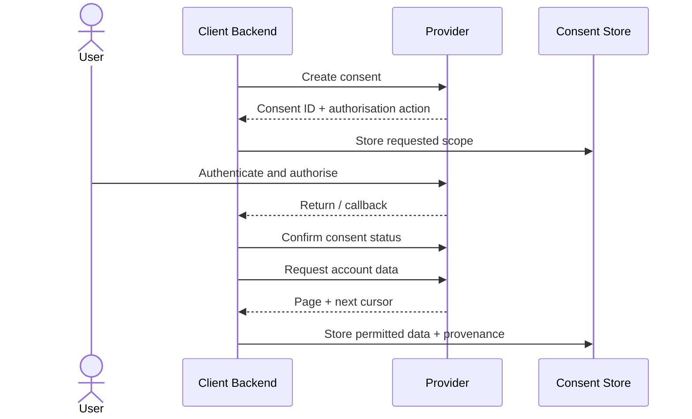

# How to Implement an Account-Data Access Flow

**Diátaxis type:** How-to guide  
**Outcome:** Obtain authorised account data while preserving consent scope, pagination and auditability

## Procedure

1. Create a local consent intent containing the requested permissions, purpose, expiry and correlation ID.
2. Create the provider consent resource using its current API contract.
3. Store the provider consent ID and returned authorisation action.
4. Send the user through the provider's authorisation journey.
5. Treat the return redirect as navigation; read the provider consent status server-side.
6. Exchange the authorised result for credentials using the documented flow.
7. Retrieve only resources within the granted scope.
8. Follow pagination links or cursors exactly; do not guess page numbers.
9. Record data freshness, provider request IDs and the consent used for access.
10. Stop collection and delete or retain data according to policy when consent ends.

## Operational controls

- Bound retries and honour rate-limit guidance.
- Distinguish “no data” from “request failed.”
- Use conditional updates so a late success cannot reactivate a revoked consent.
- Encrypt credentials and sensitive account data.
- Never expose provider tokens to browser code.
