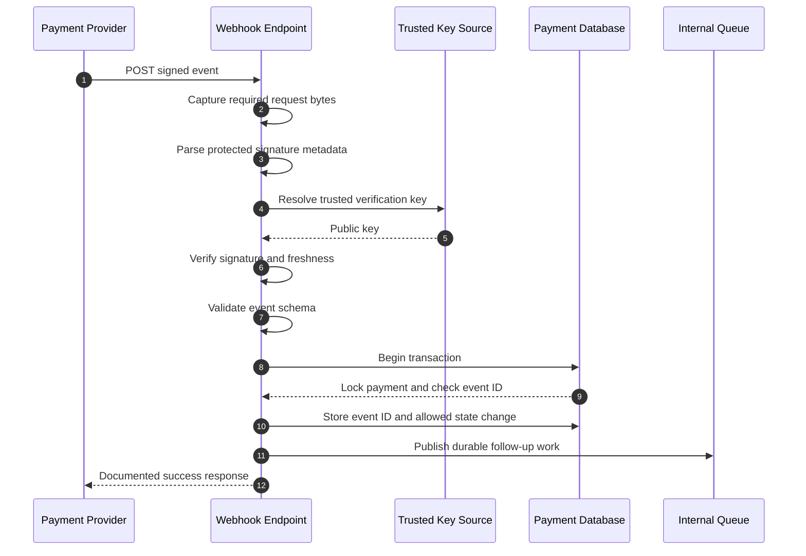

# How to Verify and Process a Signed Payment Webhook

**Diátaxis type:** How-to guide  
**Audience:** Backend engineers integrating asynchronous payment events  
**Outcome:** Accept an authentic event once, apply an allowed payment-state change and acknowledge it without causing unnecessary redelivery

This guide provides a provider-neutral procedure for receiving signed payment webhooks. Replace every placeholder header, algorithm, key source and response code with values from your provider's current webhook contract.

## Before you begin

You need:

- a public HTTPS endpoint dedicated to payment webhooks;
- the provider's webhook-signing specification;
- a trusted source for its verification keys;
- durable storage for processed event IDs;
- an existing provider-to-internal status map; and
- a sandbox event or provider-supplied test fixture.

Do not use the example names in this guide as a production contract.

## Processing sequence



The exact signed input depends on the provider's scheme. It may cover the raw body alone or combine the HTTP method, request target, selected headers and body. Follow the published contract exactly.

## 1. Keep the acknowledgement path isolated

Expose a narrow endpoint for provider events, for example:

```http
POST /webhooks/payments HTTP/1.1
Content-Type: application/json
Provider-Signature: <provider-defined-value>
Provider-Timestamp: <provider-defined-value>
```

Configure the route so that middleware does not discard request material required for verification. In frameworks that automatically parse JSON, retain the original bytes when the signature scheme covers the body bytes.

Apply a request-size limit before buffering the body. Do not log complete event bodies unless your data-handling policy explicitly permits it.

## 2. Read the signature metadata defensively

Extract only the headers required by the provider contract. Treat missing, duplicated or malformed security headers as authentication failures.

```text
signature = required_header("Provider-Signature")
timestamp = required_header("Provider-Timestamp")
key_id = protected_header(signature, "kid")
```

The timestamp and key identifier are illustrative. Some schemes place them inside the protected JWS header; others use HTTP headers or a fixed configured key.

Reject metadata that violates the provider's documented encoding, algorithm or size constraints. Do not allow an untrusted event to choose an algorithm your integration did not configure.

## 3. Resolve a trusted verification key

Resolve the public key from a source established during integration—not from an arbitrary URL supplied by the incoming request.

An acceptable design might use:

- a provider-documented JSON Web Key Set (JWKS) endpoint over HTTPS;
- a public key pinned in configuration; or
- a verified key set distributed through the provider's control plane.

When using a key identifier:

1. look it up in the trusted key set;
2. confirm that the key type, use and algorithm match policy;
3. refresh a cached key set once if a previously unseen identifier appears; and
4. fail closed if no trusted key matches.

Cache keys according to the provider's guidance and HTTP caching metadata. Design rotation so that an old and new key can overlap where the provider supports it.

## 4. Reconstruct the signed input exactly

Build the verification input exactly as the provider defines it.

```text
signed_input = build_provider_input(
    method = request.method,
    target = request.path_and_query,
    headers = selected_headers,
    body = request.original_body_bytes
)
```

Common causes of verification failure include:

- parsing and reserialising JSON before verification;
- changing whitespace or line endings;
- using a decoded path when the scheme signs the encoded request target;
- dropping a signed query string;
- normalising a signed header differently; and
- verifying against the wrong environment's key.

Only include request components specified by the provider. Adding fields to the signed input is just as incorrect as omitting them.

## 5. Verify the signature before trusting the event

Use a maintained cryptographic library that supports the required scheme. Configure the expected algorithm instead of accepting any algorithm declared by the event.

```text
verified = verify_signature(
    algorithm = configured_algorithm,
    public_key = trusted_key,
    signature = signature,
    input = signed_input
)

if !verified:
    record_safe_metric("webhook_signature_invalid")
    return authentication_failure
```

Do not write payment state, enqueue business work or use body fields for resource lookup until verification succeeds.

If your scheme uses a message authentication code rather than a public-key signature, compare authentication values using the constant-time operation supplied by the cryptographic library.

## 6. Enforce the provider's replay controls

Signature verification proves that signed material was authentic; by itself, it does not prove that the request is new.

Where the contract includes a signed timestamp:

1. parse it using the required format;
2. compare it with a trusted server clock;
3. allow only the documented clock skew; and
4. reject events outside the permitted age window.

```text
if abs(trusted_now - signed_timestamp) > configured_tolerance:
    record_safe_metric("webhook_timestamp_rejected")
    return authentication_failure
```

Keep hosts time-synchronised and monitor clock drift. Never invent a replay window if the provider defines one; use its documented requirement.

Freshness checks do not replace event deduplication. A valid event can be delivered more than once within the permitted window.

## 7. Parse and validate the authenticated event

After verification, parse the JSON and validate it against the expected event schema.

Check at minimum:

- event identifier;
- event type and supported schema version;
- provider payment identifier;
- payment status and reason fields; and
- required timestamps.

Reject or quarantine unsupported versions instead of silently ignoring fields that might change the event's meaning.

Do not assume a verified event refers to a known payment. Handle unknown identifiers without exposing internal records in the response.

## 8. Deduplicate and update state atomically

Use the provider's stable event identifier when available. Apply the event and record that identifier in one transaction or an equivalent atomic operation.

```text
begin transaction
    if processed_events.exists(event.id):
        commit
        return documented_success

    payment = payments.lock_by_provider_id(event.payment_id)

    if payment is missing:
        record_unknown_payment(event)
        commit
        return documented_success_or_provider_required_response

    next_state = map_provider_status(event.status)

    if !transition_allowed(payment.state, next_state):
        record_transition_conflict(payment, event)
        commit
        return documented_success

    payments.update_state(payment.id, next_state)
    processed_events.insert(event.id)
    outbox.insert(follow_up_work(payment.id, event.id))
commit
```

The unique constraint on the processed event ID is a final concurrency control—not merely an application-level pre-check.

Do not regress a terminal payment state because an older event arrives late. Route unexpected transitions to operations with enough non-sensitive context to investigate.

## 9. Acknowledge only durable acceptance

Return the provider's documented success response after the event and its required state change are durably recorded.

Keep slow work out of the response path. Publish notifications, analytics, fulfilment and other downstream actions through a transactional outbox or equivalent durable queue mechanism.

Do not return a success response when the event was lost before durable acceptance. Conversely, avoid returning errors for a duplicate event that was already processed successfully; that can cause pointless redelivery.

## 10. Add safe operational telemetry

Record structured fields such as:

- provider event ID;
- provider payment ID;
- event type and schema version;
- verification outcome and failure category;
- key identifier, when non-sensitive;
- previous and resulting internal states;
- duplicate-event outcome;
- processing duration; and
- correlation or request ID.

Do not log private keys, shared secrets, access tokens, full signatures or unnecessary payment and personal data.

Alert on:

- sustained signature failures;
- unusual unknown-key rates;
- timestamp rejection spikes;
- growing webhook-processing latency;
- repeated transition conflicts; and
- failures publishing durable follow-up work.

## Failure handling

| Failure | Recommended action | External response |
| --- | --- | --- |
| Required signature metadata is missing | Record an authentication failure; do not parse for business processing | Provider-documented authentication failure |
| No trusted key matches | Refresh once if permitted, then fail closed | Provider-documented authentication failure |
| Signature verification fails | Make no state change | Provider-documented authentication failure |
| Signed timestamp is outside tolerance | Make no state change | Provider-documented authentication failure |
| Event schema is unsupported | Quarantine safely and alert | Follow the provider contract |
| Event ID already exists | Perform no additional side effects | Documented success response |
| Payment ID is unknown | Record safely and investigate | Follow the provider contract |
| State transition is stale or disallowed | Preserve trusted state and investigate | Usually acknowledge if the authentic event was durably recorded |
| Database transaction fails | Roll back | Retryable failure according to the provider contract |

Response codes are deliberately not prescribed here because providers use different retry and acknowledgement contracts.

## Verification checklist

- [ ] The endpoint is HTTPS-only and applies a request-size limit.
- [ ] Required request bytes are retained without unauthorised normalisation.
- [ ] Security headers are validated for presence, format and size.
- [ ] Verification keys come only from a preconfigured trusted source.
- [ ] The accepted algorithm is configured locally.
- [ ] The signature is verified before body fields affect state.
- [ ] Provider-defined freshness controls are enforced.
- [ ] Event schema and version are validated after authentication.
- [ ] Event deduplication is protected by a durable uniqueness constraint.
- [ ] Event recording and payment updates are atomic.
- [ ] Late events cannot regress terminal states.
- [ ] Slow side effects use an outbox or durable queue.
- [ ] Duplicate authenticated events receive the documented success response.
- [ ] Logs and metrics exclude secrets and unnecessary sensitive data.
- [ ] Key rotation, clock drift and redelivery are covered by tests.

## Test the implementation

Use provider-supplied fixtures or sandbox tooling wherever available. Test at least:

1. a valid event signed by the active key;
2. a valid event signed by a rotation key;
3. a one-byte body modification;
4. a missing and malformed signature;
5. an unapproved algorithm;
6. an unknown key identifier;
7. an expired and future-dated timestamp;
8. the same valid event delivered concurrently;
9. valid events delivered out of order;
10. an unsupported schema version; and
11. a database failure before commit.

Confirm the resulting database state and downstream side effects—not only the HTTP response.

## Related documentation

- [Payment Initiation Integration Guide](../pis/payment-initiation-flow.md)
- Webhook security reference — planned
- Explanation: replay attacks, duplicate delivery and event ordering — planned
- Tutorial: test a local webhook receiver — planned

## Standards references

- [RFC 7515: JSON Web Signature](https://www.rfc-editor.org/rfc/rfc7515)
- [RFC 7517: JSON Web Key](https://www.rfc-editor.org/rfc/rfc7517)
- [RFC 9110: HTTP Semantics](https://www.rfc-editor.org/rfc/rfc9110)
